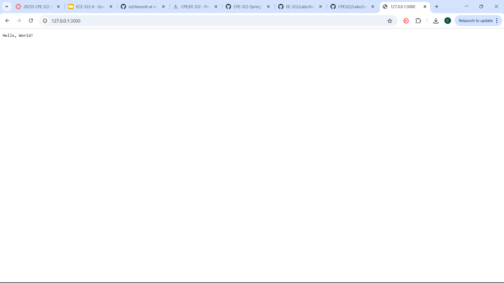

# Lab 6
## CPE 322
### Connor Hsuan
---
### Node, Node Package Manger, and Header

---
### Running the code

---
### hello-world.js Output

---
### hello.js Output

---
### http.js Output

---
### pystache

