# Lab 9
## CPE 322
### Connor Hsuan
---
### cat intrusiondetection.yang
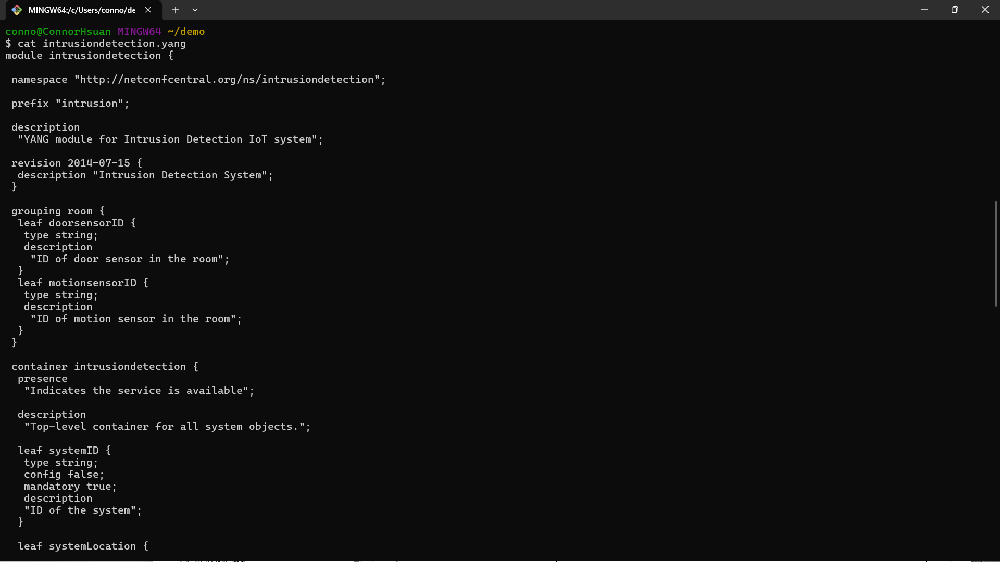
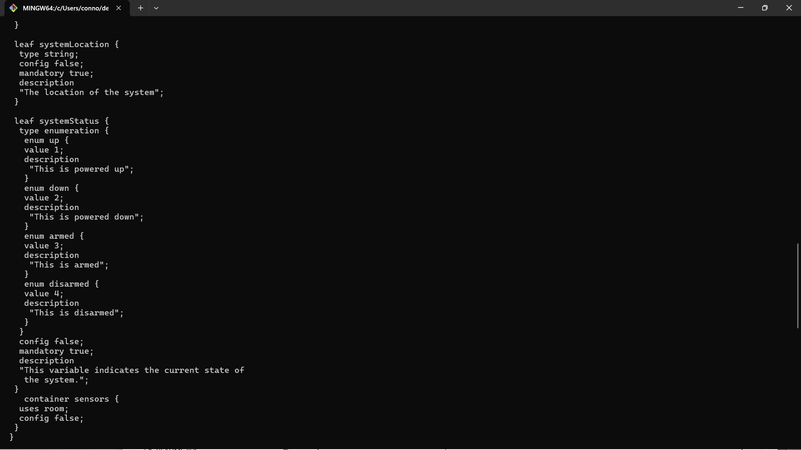
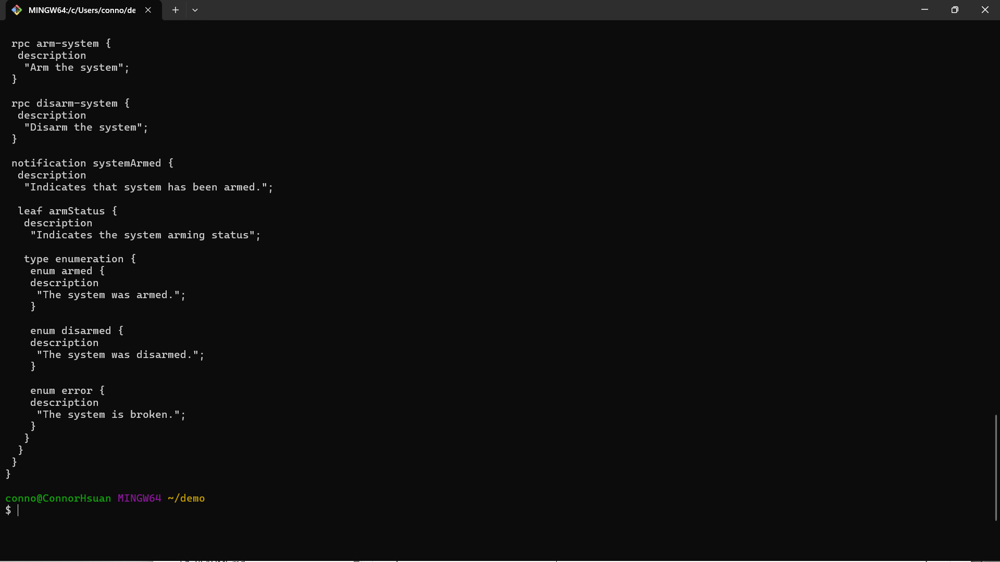
### cat intrusiondetection.yin
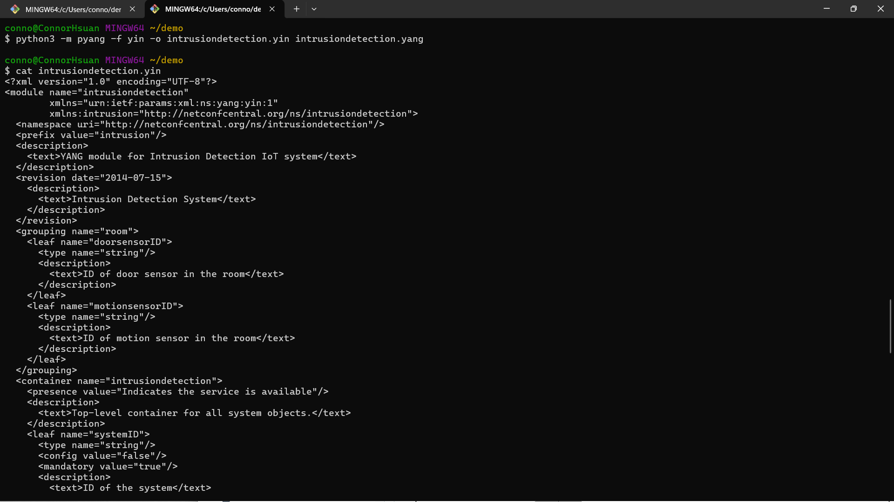
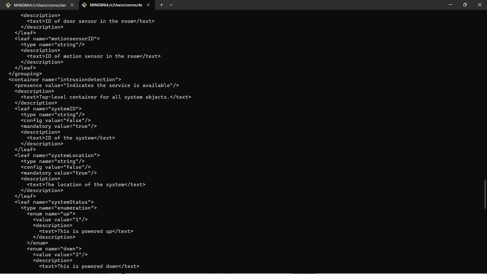
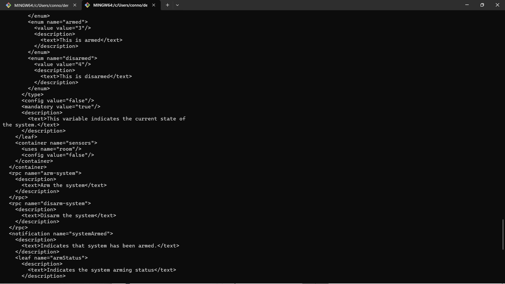
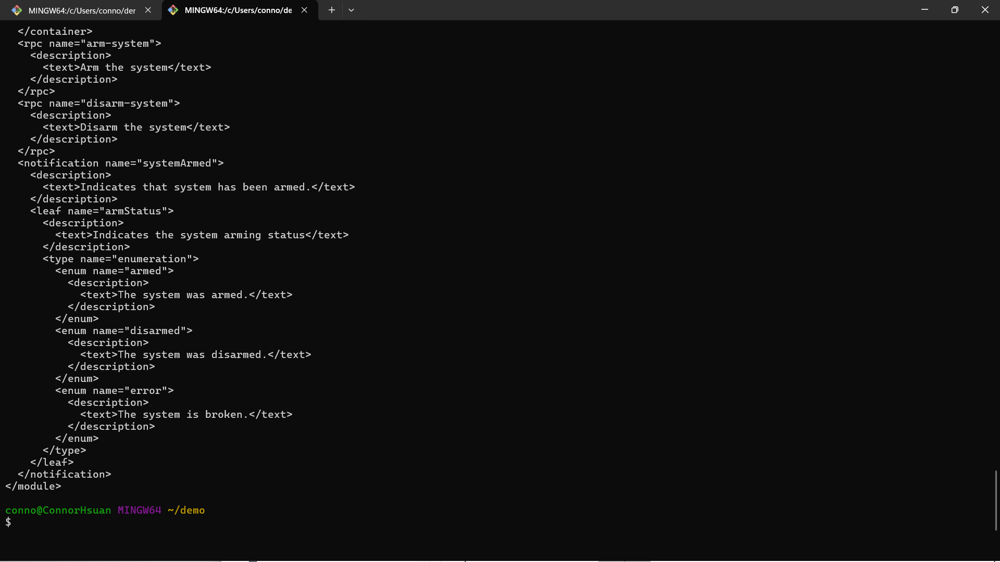
### cat intrusiondetection.uml
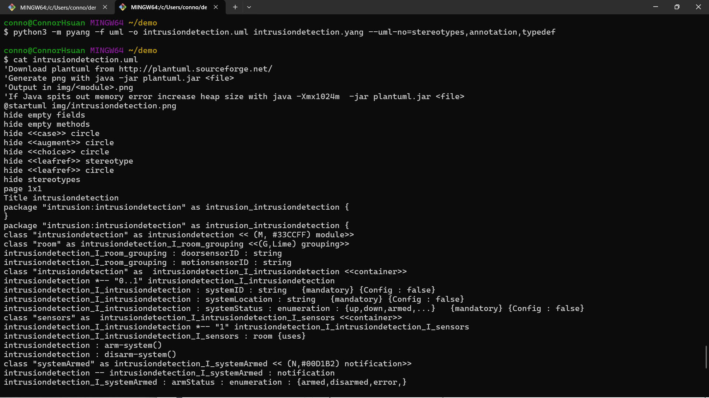
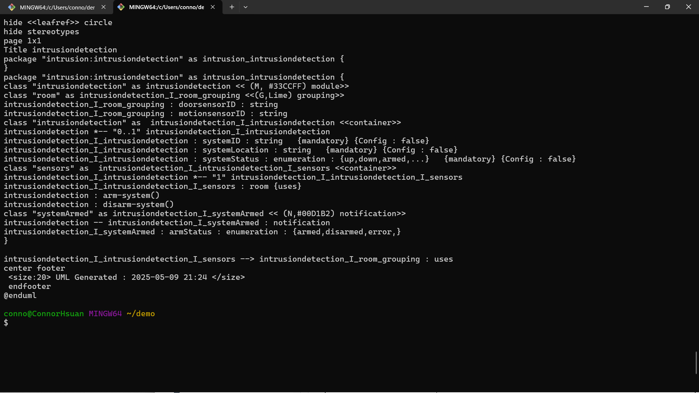
### python3 -m plantuml intrusiondetection.uml
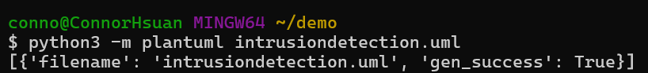
### Pinta
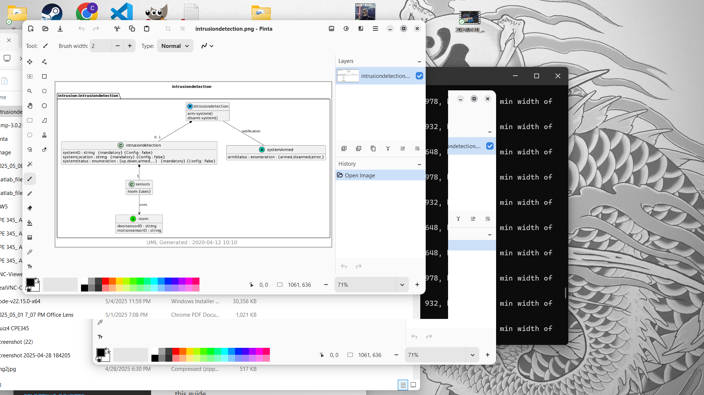
### Gimp
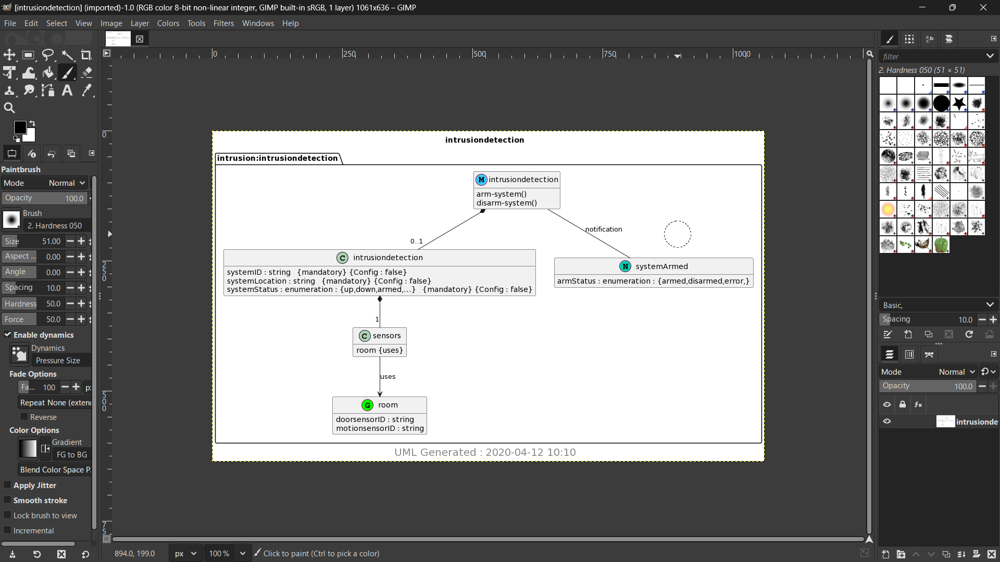
